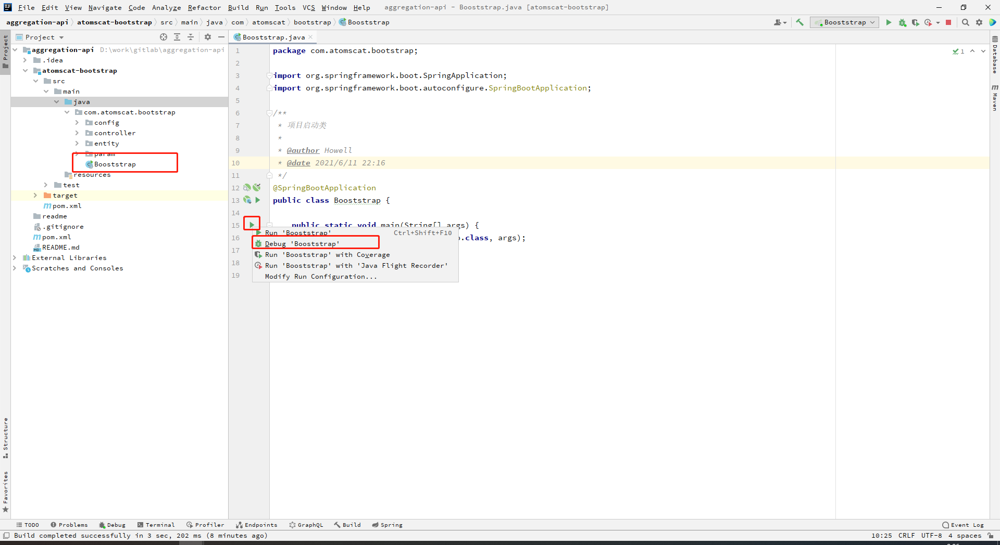

#### 开发环境准备
```
 1、jdk 8
 2、jetbrains idea
```
#### 开发环境启动项目
```
目录文件 ： atomscat-bootstrap -> src -> main -> java -> com.atomscat.bootstrap -> Booststrap
```



#### swagger-ui 地址
```
http://localhost:8080/swagger-ui/index.html
```

#### api-docs.json 地址
```
http://localhost:8080/v2/api-docs
```

### 接口
```
# 爬数据接口
http://127.0.0.1:8899/api/weixin/cp/getDocFetch

# 生成openapi文档接口
http://127.0.0.1:8899/api/weixin/cp/getOpenAPI


```